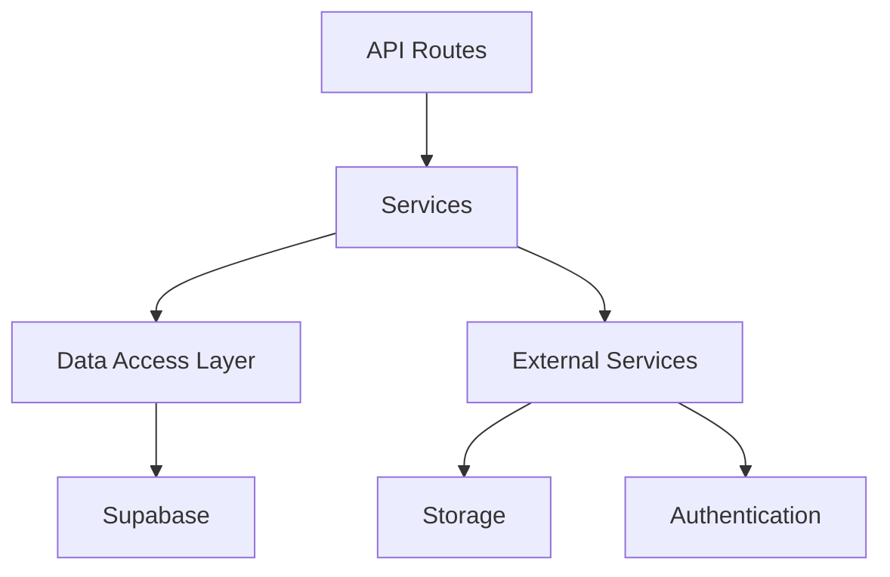

# 🔧 Backend Service Layer Guide - PetHug

## 📋 Table of Contents
1. [Service Layer Architecture](#service-layer-architecture)
2. [Directory Structure](#directory-structure)
3. [Service Implementation](#service-implementation)
4. [Error Handling](#error-handling)
5. [Database Access](#database-access)
6. [Validation](#validation)
7. [Examples](#examples)

## Service Layer Architecture



## Directory Structure

```plaintext
src/
├── services/
│   ├── base/
│   │   ├── BaseService.ts
│   │   └── ServiceError.ts
│   ├── pet/
│   │   ├── PetService.ts
│   │   ├── dto/
│   │   │   ├── CreatePetDto.ts
│   │   │   └── UpdatePetDto.ts
│   │   └── interfaces/
│   │       └── IPetService.ts
│   ├── user/
│   │   ├── UserService.ts
│   │   └── interfaces/
│   │       └── IUserService.ts
│   ├── chat/
│   │   ├── ChatService.ts
│   │   └── interfaces/
│   │       └── IChatService.ts
│   └── contract/
│       ├── ContractService.ts
│       └── interfaces/
│           └── IContractService.ts
├── lib/
│   ├── supabase/
│   │   └── client.ts
│   └── validators/
│       └── index.ts
└── types/
    └── index.ts
```

## Service Implementation

### Base Service
```typescript
// src/services/base/BaseService.ts
export abstract class BaseService {
  protected supabase: SupabaseClient;

  constructor() {
    this.supabase = createSupabaseClient();
  }

  protected async handleError(error: any): Promise<never> {
    if (error instanceof ServiceError) {
      throw error;
    }

    console.error('Service Error:', error);
    throw new ServiceError('INTERNAL_ERROR', 'An unexpected error occurred');
  }
}

// src/services/base/ServiceError.ts
export class ServiceError extends Error {
  constructor(
    public code: string,
    public message: string,
    public details?: any
  ) {
    super(message);
    this.name = 'ServiceError';
  }
}
```

### Pet Service Example
```typescript
// src/services/pet/interfaces/IPetService.ts
export interface IPetService {
  create(data: CreatePetDto): Promise<Pet>;
  findById(id: string): Promise<Pet>;
  update(id: string, data: UpdatePetDto): Promise<Pet>;
  delete(id: string): Promise<void>;
  list(params: PetListParams): Promise<PaginatedResponse<Pet>>;
}

// src/services/pet/PetService.ts
@Injectable()
export class PetService extends BaseService implements IPetService {
  async create(data: CreatePetDto): Promise<Pet> {
    try {
      // Validate input
      await this.validatePetData(data);

      // Upload images if provided
      const imageUrls = await this.uploadImages(data.images);

      // Create pet record
      const { data: pet, error } = await this.supabase
        .from('pets')
        .insert({
          ...data,
          images: imageUrls,
          status: 'AVAILABLE'
        })
        .select()
        .single();

      if (error) throw error;
      return pet;

    } catch (error) {
      return this.handleError(error);
    }
  }

  async findById(id: string): Promise<Pet> {
    try {
      const { data: pet, error } = await this.supabase
        .from('pets')
        .select(`
          *,
          owner:profiles(*)
        `)
        .eq('id', id)
        .single();

      if (error) throw error;
      if (!pet) throw new ServiceError('NOT_FOUND', 'Pet not found');

      return pet;

    } catch (error) {
      return this.handleError(error);
    }
  }

  async list(params: PetListParams): Promise<PaginatedResponse<Pet>> {
    try {
      let query = this.supabase
        .from('pets')
        .select(`
          *,
          owner:profiles(*),
          total_count:count(*) OVER()
        `);

      // Apply filters
      if (params.type) {
        query = query.eq('type', params.type);
      }

      if (params.status) {
        query = query.eq('status', params.status);
      }

      // Apply pagination
      const from = (params.page - 1) * params.limit;
      const to = from + params.limit - 1;
      query = query.range(from, to);

      const { data, error } = await query;
      if (error) throw error;

      const total = data[0]?.total_count ?? 0;

      return {
        data: data.map(item => {
          const { total_count, ...pet } = item;
          return pet;
        }),
        meta: {
          total,
          page: params.page,
          limit: params.limit,
          hasMore: total > (params.page * params.limit)
        }
      };

    } catch (error) {
      return this.handleError(error);
    }
  }
}
```

### Chat Service Example
```typescript
// src/services/chat/interfaces/IChatService.ts
export interface IChatService {
  createChat(petId: string, userId: string): Promise<Chat>;
  sendMessage(chatId: string, userId: string, content: string): Promise<Message>;
  listMessages(chatId: string, params: PaginationParams): Promise<PaginatedResponse<Message>>;
}

// src/services/chat/ChatService.ts
@Injectable()
export class ChatService extends BaseService implements IChatService {
  async createChat(petId: string, userId: string): Promise<Chat> {
    try {
      // Start transaction
      const { data: chat, error: chatError } = await this.supabase
        .from('chats')
        .insert({ pet_id: petId })
        .select()
        .single();

      if (chatError) throw chatError;

      // Add participants
      const { error: participantError } = await this.supabase
        .from('chat_participants')
        .insert([
          { chat_id: chat.id, user_id: userId }
        ]);

      if (participantError) throw participantError;

      return chat;

    } catch (error) {
      return this.handleError(error);
    }
  }

  async sendMessage(chatId: string, userId: string, content: string): Promise<Message> {
    try {
      // Validate participant
      const isParticipant = await this.validateChatParticipant(chatId, userId);
      if (!isParticipant) {
        throw new ServiceError('FORBIDDEN', 'User is not a chat participant');
      }

      // Send message
      const { data: message, error } = await this.supabase
        .from('messages')
        .insert({
          chat_id: chatId,
          sender_id: userId,
          content
        })
        .select()
        .single();

      if (error) throw error;
      return message;

    } catch (error) {
      return this.handleError(error);
    }
  }
}
```

## Error Handling

### Error Types
```typescript
// src/types/errors.ts
export type ErrorCode =
  | 'BAD_REQUEST'
  | 'UNAUTHORIZED'
  | 'FORBIDDEN'
  | 'NOT_FOUND'
  | 'VALIDATION_ERROR'
  | 'INTERNAL_ERROR';

export interface ServiceErrorResponse {
  code: ErrorCode;
  message: string;
  details?: Record<string, any>;
}
```

### Error Handling in Services
```typescript
protected async handleServiceError(error: any): Promise<never> {
  if (error instanceof ServiceError) {
    throw error;
  }

  // Handle Supabase errors
  if (error.code === '23505') { // Unique violation
    throw new ServiceError('BAD_REQUEST', 'Resource already exists');
  }

  // Handle validation errors
  if (error.name === 'ValidationError') {
    throw new ServiceError('VALIDATION_ERROR', 'Invalid input', error.details);
  }

  // Log unexpected errors
  console.error('Unexpected error:', error);
  throw new ServiceError('INTERNAL_ERROR', 'An unexpected error occurred');
}
```

## Validation

### Request Validation
```typescript
// src/lib/validators/pet.ts
import { z } from 'zod';

export const createPetSchema = z.object({
  name: z.string().min(1).max(255),
  type: z.enum(['DOG', 'CAT', 'RABBIT', 'BIRD']),
  breed: z.string().optional(),
  age: z.number().min(0).max(30),
  gender: z.enum(['MALE', 'FEMALE']),
  description: z.string().optional(),
  images: z.array(z.string()).min(1).max(4)
});

export type CreatePetDto = z.infer<typeof createPetSchema>;
```

## Database Access

### Supabase Client Configuration
```typescript
// src/lib/supabase/client.ts
import { createClient } from '@supabase/supabase-js';

export const createSupabaseClient = () => {
  return createClient(
    process.env.NEXT_PUBLIC_SUPABASE_URL!,
    process.env.NEXT_PUBLIC_SUPABASE_ANON_KEY!
  );
};
```

### Using Database Transactions
```typescript
async createPetWithContract(data: CreatePetWithContractDto): Promise<Pet> {
  const client = this.supabase;

  try {
    const { pet, contract } = await client.rpc('create_pet_with_contract', {
      pet_data: data.pet,
      contract_data: data.contract
    });

    return pet;

  } catch (error) {
    return this.handleError(error);
  }
}
```

## Examples

### API Route Implementation
```typescript
// app/api/pets/route.ts
import { NextResponse } from 'next/server';
import { PetService } from '@/services/pet/PetService';

const petService = new PetService();

export async function GET(request: Request) {
  try {
    const { searchParams } = new URL(request.url);
    const params = {
      page: parseInt(searchParams.get('page') || '1'),
      limit: parseInt(searchParams.get('limit') || '10'),
      type: searchParams.get('type') as PetType
    };

    const result = await petService.list(params);
    return NextResponse.json(result);

  } catch (error) {
    if (error instanceof ServiceError) {
      return NextResponse.json(
        { error: { 
            code: error.code,
            message: error.message,
            details: error.details 
          }
        },
        { status: getHttpStatus(error.code) }
      );
    }

    return NextResponse.json(
      { error: { 
          code: 'INTERNAL_ERROR',
          message: 'An unexpected error occurred' 
        }
      },
      { status: 500 }
    );
  }
}
```
