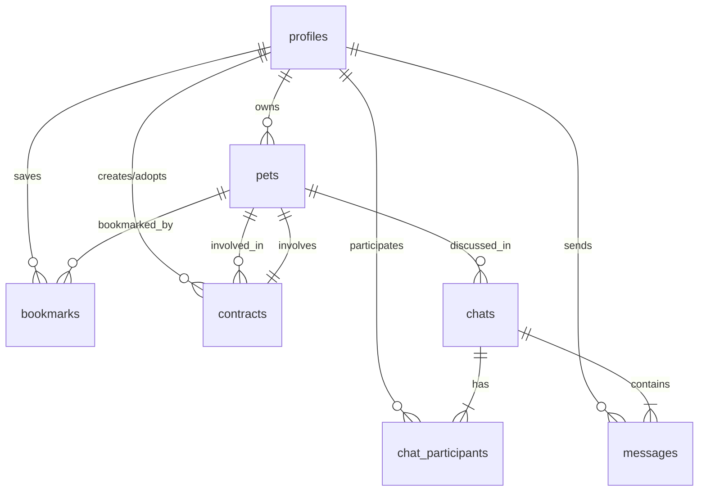

# 📊 Entity Relationship Diagram - PetHug

## 🔄 Database Relations


## 📝 Entities Description

### 1. profiles
```sql
create table public.profiles (
    id uuid references auth.users primary key,
    email varchar(255) unique not null,
    full_name varchar(255),
    avatar_url text,
    province varchar(100),
    personality text[],
    created_at timestamp with time zone default timezone('utc'::text, now()),
    updated_at timestamp with time zone default timezone('utc'::text, now())
);

comment on table public.profiles is 'User profiles for the application';
```

### 2. pets
```sql
create table public.pets (
    id uuid default uuid_generate_v4() primary key,
    owner_id uuid references public.profiles(id) not null,
    name varchar(255) not null,
    type varchar(50) not null,
    breed varchar(100),
    age integer,
    gender varchar(10),
    vaccines text[],
    personality text[],
    description text,
    images text[],
    status varchar(20) default 'AVAILABLE',
    created_at timestamp with time zone default timezone('utc'::text, now()),
    updated_at timestamp with time zone default timezone('utc'::text, now())
);

comment on table public.pets is 'Pets available for adoption';
```

### 3. bookmarks
```sql
create table public.bookmarks (
    id uuid default uuid_generate_v4() primary key,
    user_id uuid references public.profiles(id) not null,
    pet_id uuid references public.pets(id) not null,
    created_at timestamp with time zone default timezone('utc'::text, now()),
    unique(user_id, pet_id)
);

comment on table public.bookmarks is 'Saved pets by users';
```

### 4. chats
```sql
create table public.chats (
    id uuid default uuid_generate_v4() primary key,
    pet_id uuid references public.pets(id) not null,
    status varchar(20) default 'ACTIVE',
    created_at timestamp with time zone default timezone('utc'::text, now()),
    updated_at timestamp with time zone default timezone('utc'::text, now())
);

comment on table public.chats is 'Chat rooms between users';
```

### 5. chat_participants
```sql
create table public.chat_participants (
    chat_id uuid references public.chats(id) not null,
    user_id uuid references public.profiles(id) not null,
    joined_at timestamp with time zone default timezone('utc'::text, now()),
    primary key (chat_id, user_id)
);

comment on table public.chat_participants is 'Users participating in chats';
```

### 6. messages
```sql
create table public.messages (
    id uuid default uuid_generate_v4() primary key,
    chat_id uuid references public.chats(id) not null,
    sender_id uuid references public.profiles(id) not null,
    content text not null,
    type varchar(20) default 'TEXT',
    read_by uuid[] default '{}',
    created_at timestamp with time zone default timezone('utc'::text, now())
);

comment on table public.messages is 'Chat messages between users';
```

### 7. contracts
```sql
create table public.contracts (
    id uuid default uuid_generate_v4() primary key,
    pet_id uuid references public.pets(id) not null,
    owner_id uuid references public.profiles(id) not null,
    adopter_id uuid references public.profiles(id) not null,
    status varchar(20) default 'PENDING',
    terms text not null,
    owner_signature jsonb,
    adopter_signature jsonb,
    signed_at timestamp with time zone,
    document_url text,
    created_at timestamp with time zone default timezone('utc'::text, now()),
    updated_at timestamp with time zone default timezone('utc'::text, now())
);

comment on table public.contracts is 'Adoption contracts between users';
```

## 🔐 Row Level Security (RLS)

### profiles
```sql
-- Enable RLS
alter table public.profiles enable row level security;

-- View profile policy
create policy "Public profiles are viewable by everyone"
on public.profiles for select
using (true);

-- Update own profile
create policy "Users can update own profile"
on public.profiles for update
using (auth.uid() = id);
```

### pets
```sql
-- Enable RLS
alter table public.pets enable row level security;

-- View pets policy
create policy "Pets are viewable by everyone"
on public.pets for select
using (true);

-- Create/Update/Delete pet policy
create policy "Users can manage own pets"
on public.pets for all
using (auth.uid() = owner_id);
```

### messages
```sql
-- Enable RLS
alter table public.messages enable row level security;

-- View/Create message policy
create policy "Chat participants can view messages"
on public.messages for select
using (
    auth.uid() in (
        select user_id
        from public.chat_participants
        where chat_id = messages.chat_id
    )
);
```

## 📈 Indexes

```sql
-- pets table indexes
create index pets_owner_id_idx on public.pets(owner_id);
create index pets_type_idx on public.pets(type);
create index pets_status_idx on public.pets(status);

-- messages table indexes
create index messages_chat_id_created_at_idx on public.messages(chat_id, created_at);
create index messages_sender_id_idx on public.messages(sender_id);

-- bookmarks table indexes
create index bookmarks_user_id_idx on public.bookmarks(user_id);
create index bookmarks_pet_id_idx on public.bookmarks(pet_id);

-- contracts table indexes
create index contracts_pet_id_idx on public.contracts(pet_id);
create index contracts_owner_id_idx on public.contracts(owner_id);
create index contracts_adopter_id_idx on public.contracts(adopter_id);
```

## 🔄 Database Triggers

### Update Timestamps
```sql
-- Function to update timestamp
create or replace function public.handle_updated_at()
returns trigger as $$
begin
    new.updated_at = now();
    return new;
end;
$$ language plpgsql;

-- Add trigger to relevant tables
create trigger handle_updated_at
    before update on public.profiles
    for each row
    execute procedure public.handle_updated_at();

create trigger handle_updated_at
    before update on public.pets
    for each row
    execute procedure public.handle_updated_at();
```

### Update Chat Status
```sql
-- Function to update chat status
create or replace function public.handle_chat_status()
returns trigger as $$
begin
    update public.chats
    set status = 
        case 
            when exists (
                select 1 
                from public.chat_participants 
                where chat_id = new.chat_id
                group by chat_id 
                having count(*) >= 2
            ) then 'ACTIVE'
            else 'PENDING'
        end
    where id = new.chat_id;
    return new;
end;
$$ language plpgsql;

-- Add trigger
create trigger handle_chat_status
    after insert or delete on public.chat_participants
    for each row
    execute procedure public.handle_chat_status();
```
