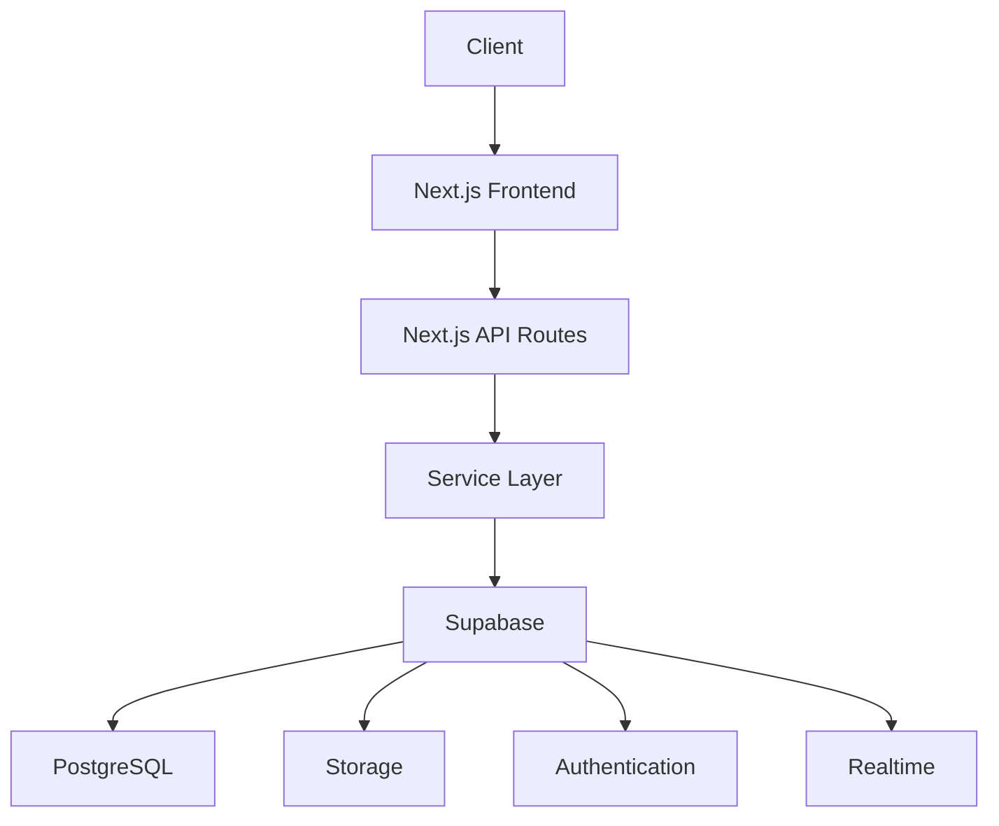
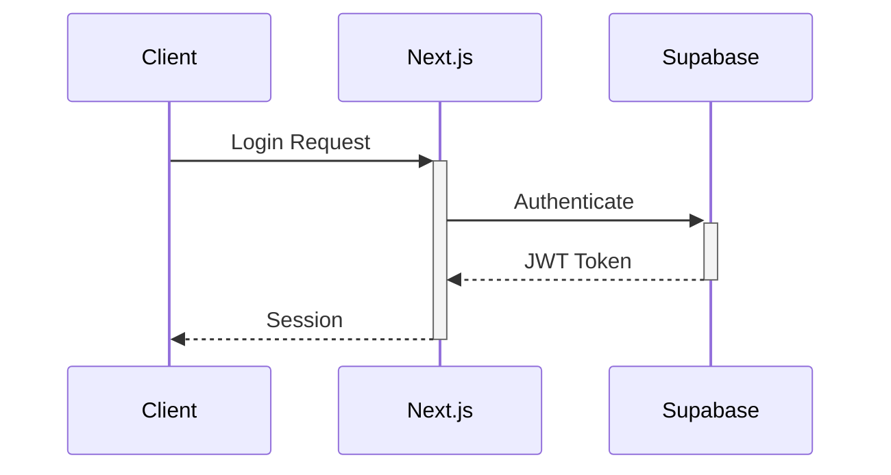
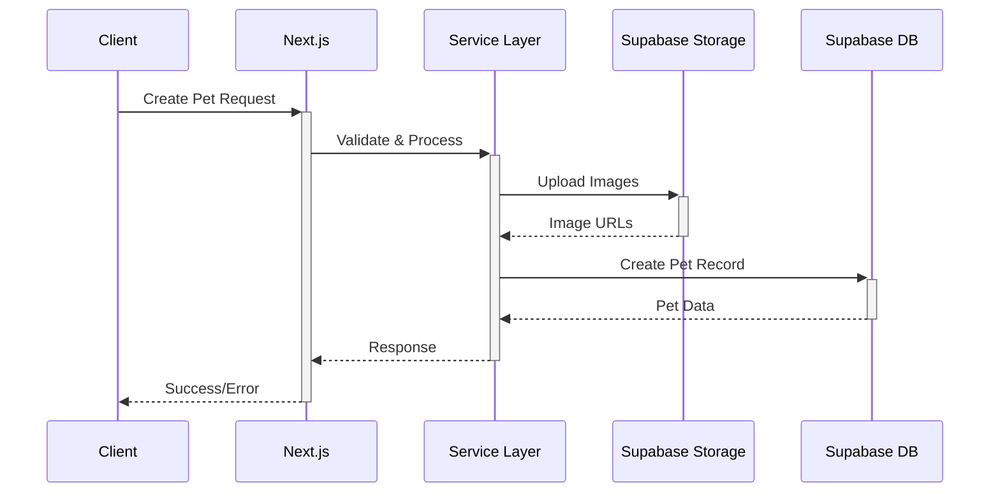
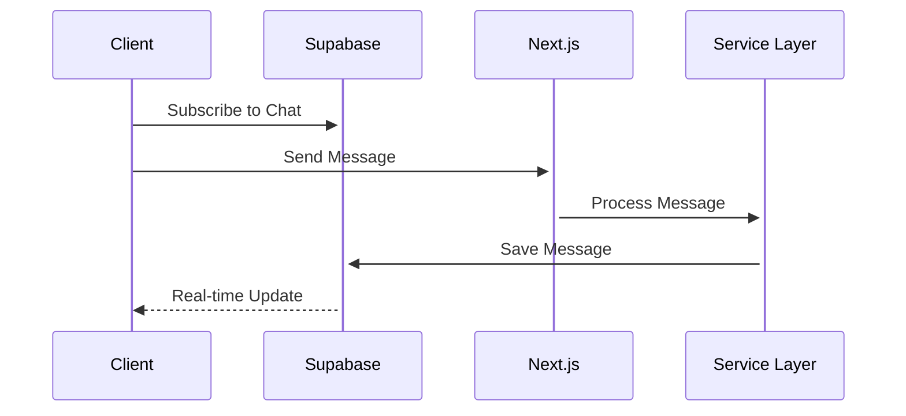

# 🏗 Architecture Documentation - PetHug

## 📋 Overview
เอกสารชุดนี้อธิบายสถาปัตยกรรมและการออกแบบระบบของ PetHug แพลตฟอร์มสำหรับหาบ้านให้สัตว์เลี้ยง

## 📑 Documentation Structure

### [API Standardization Guide](./API-Standardization-Guide.md)
- มาตรฐานการออกแบบ API
- รูปแบบ Request/Response
- Error Handling
- Authentication & Authorization
- Rate Limiting
- Security Standards
- ตัวอย่างการใช้งาน

### [Backend Service Layer Guide](./Backend-Service-Layer-Guide.md)
- โครงสร้าง Service Layer
- การจัดการ Directory Structure
- ตัวอย่าง Service Implementation
- Error Handling
- Database Access
- Validation
- ตัวอย่างการใช้งาน

### [ER Diagram](./ER-Diagram.md)
- แผนภาพ Entity Relationship
- โครงสร้างฐานข้อมูล
- Row Level Security (RLS)
- Database Indexes
- Database Triggers

## 🏛 System Architecture



## 🛠 Tech Stack

### Frontend
- Next.js 13+ (App Router)
- TypeScript
- Tailwind CSS
- shadcn/ui
- Zustand (State Management)

### Backend
- Next.js API Routes
- TypeScript
- Supabase Client

### Database & Services
- Supabase
  - PostgreSQL Database
  - Authentication
  - Storage
  - Realtime subscriptions

### Infrastructure
- Vercel (Frontend & API)
- Supabase Cloud

## 🔄 Data Flow

### Authentication Flow


### Pet Creation Flow


### Chat Flow


## 📡 API Structure

```plaintext
/api
├── /auth
│   ├── /login
│   └── /register
├── /pets
│   ├── GET    /           # List pets
│   ├── POST   /           # Create pet
│   ├── GET    /:id        # Get pet details
│   ├── PUT    /:id        # Update pet
│   └── DELETE /:id        # Delete pet
├── /users
│   ├── GET    /me         # Get current user
│   └── PUT    /me         # Update profile
├── /chats
│   ├── GET    /           # List chats
│   └── POST   /:id/messages # Send message
└── /contracts
    ├── POST   /           # Create contract
    └── POST   /:id/sign   # Sign contract
```

## 🔐 Security Considerations

### Authentication
- JWT-based authentication
- Secure session management
- Role-based access control

### Data Protection
- Row Level Security (RLS) in Supabase
- Input validation
- XSS prevention
- CSRF protection

### API Security
- Rate limiting
- Request validation
- Error handling
- Secure headers

## 📈 Scaling Considerations

### Performance
- Edge Functions
- CDN caching
- Image optimization
- Database indexing

### Monitoring
- Error tracking
- Performance monitoring
- User analytics
- Server metrics

## 🎯 Development Guidelines

### Code Style
- TypeScript strict mode
- ESLint configuration
- Prettier formatting
- Conventional commits

### Testing
- Unit tests
- Integration tests
- E2E tests
- Performance testing

### CI/CD
- GitHub Actions
- Automated testing
- Automated deployments
- Environment management

## 📚 Additional Resources

- [Supabase Documentation](https://supabase.com/docs)
- [Next.js Documentation](https://nextjs.org/docs)
- [Vercel Documentation](https://vercel.com/docs)
- [TypeScript Documentation](https://www.typescriptlang.org/docs)
